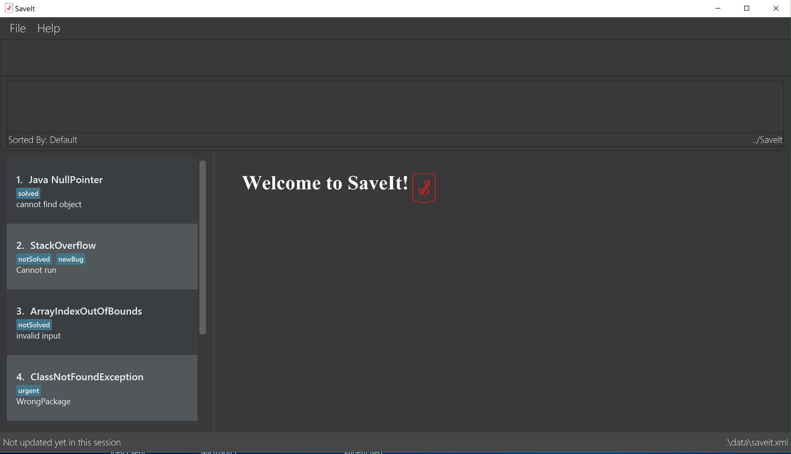

= SaveIt
ifdef::env-github,env-browser[:relfileprefix: docs/]

https://travis-ci.org/CS2103-AY1819S1-T12-4/main[image:https://travis-ci.org/CS2103-AY1819S1-T12-4/main.svg?branch=master[Build Status]]

ifdef::env-github[]

endif::[]

ifndef::env-github[]

endif::[]

SaveIt is a desktop application written in Java

* It provides a platform for you to keep track of issues that you encounter and the corresponding solutions that you found on through your search engine.

This application is geared towards programmers:

* To help keep track of bugs/error messages encountered and searched on google (or any other search engine).
* To save the webpage of the corresponding email(s) found

While programming, it is quite often that we run into similar problems that we have encountered before. Yet, we might not always remember the email (or where we found it) and go on searching for it again.

* Traditional browsers have bookmarks which allow you to keep track of webpages that you might want to visit later, however, they have a few drawbacks:
** They do not provide enough context to why the page was bookmarked (besides allowing you to set the title for the url)
** It becomes hard to manage when the list gets large, and having nested folders makes things complicated.
** It is not possible to map multiple solutions (url links) to a single issue (unless you create a folder)
* The aforementioned reasons make it infeasible to keep track of issues/bugs using bookmarks

SaveIt helps to bridge this gap by:

* Providing a platform to map issues to their email(s)
* Providing an internal search functionality to find similar issues and their solutions straight away
* The storage and search functionalities are further enhanced with a tagging system for further categorization

== Site Map
You might find these useful in getting started.

* <<UserGuide#, User Guide>>
* <<DeveloperGuide#, Developer Guide>>
* <<AboutUs#, About Us>>
* <<ContactUs#, Contact Us>>

== Acknowledgements

* The source code for this application was obtained from https://github.com/CS2103-AY1819S1-T12-4/main[SaveIt], and subsequently repackaged as a new application.
* Libraries used: https://github.com/TestFX/TestFX[TextFX], https://bitbucket.org/controlsfx/controlsfx/[ControlsFX], https://github.com/FasterXML/jackson[Jackson], https://github.com/google/guava[Guava], https://github.com/junit-team/junit5[JUnit5]

== Licence : link:LICENSE[MIT]

